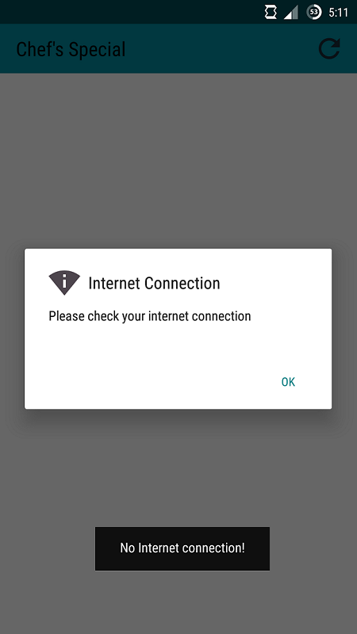
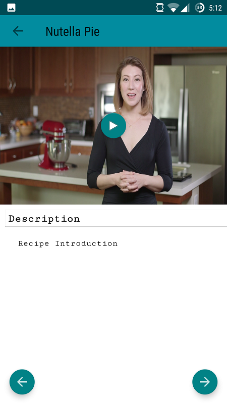

# Chef-s-Special

Chefs Special is a recipe app created under Udacity's "Android Developer 1 Nanodegree Program ".
This app has recipe description videos and a widget for the latest desired recipe ingredients.

### Screenshots

  
  
  
  

### References

1. Udacity Nanodegree Course
2. Android developer website (https://developer.android.com/index.html)
3. Stackoverflow
